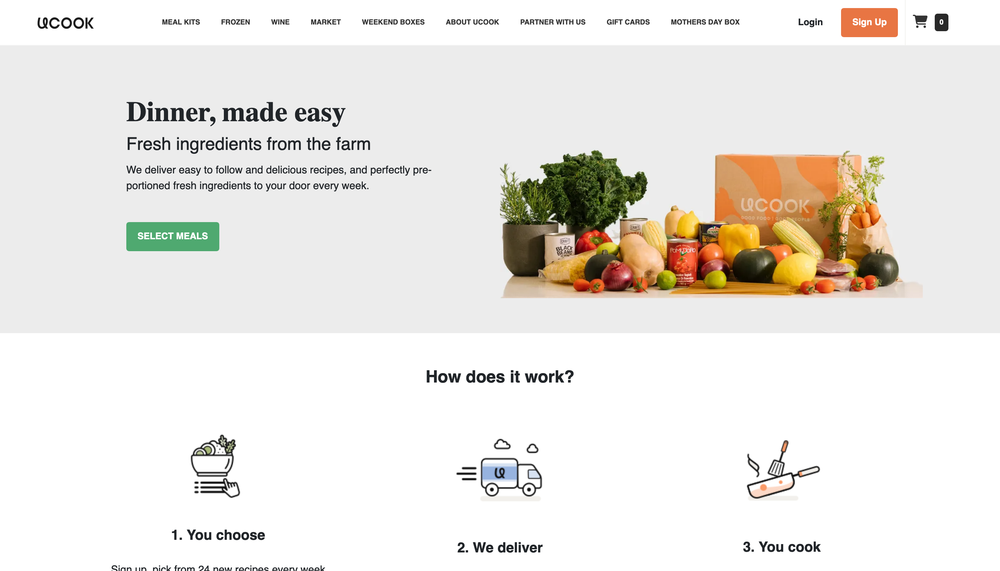

# uCook Clone

This project is a clone of the [UCOOK](https://www.ucook.co.za/) website, built using React.js. The project aims to replicate the design and functionality of the original website as closely as possible.



## Table of Contents

- [Introduction](#introduction)
- [Features](#features)
- [Setup](#setup)
- [Usage](#usage)
- [Contributing](#contributing)
  
## Introduction

The uCook Clone project aims to replicate the functionality and design of the uCook website, providing users with easy access to recipes and ingredients for home cooking. It includes several sections such as the hero section, menu section, feature section, and more.

## Features

- **Hero Section:** Introduces the website with a catchy slogan and a call-to-action button.
- **Menu Section:** Displays the current menu items available for the week.
- **Feature Section:** Explains how the service works with three key features.
- **uCook Section:** Highlights why users should choose uCook and provides a link to get started.
- **Craving Section:** Showcases various food options available.
- **Text Card Section:** Displays testimonials from satisfied customers.

## Technologies Used

- React.js
- CSS
- HTML

## Setup

1. Clone the repository:

   ```bash
   git clone https://github.com/Damilordz/ucook-clone.git
   ```
2. Navigate to the project directory:
   ```bash
    cd ucook-clone
   ```
3. Install dependencies:
   ```bash
   npm install
   ```
4. Start the development server:
   ```bash
   npm start
   ```
5. Open your browser and visit http://localhost:3000 to view the application.

## Usage

- Explore different sections of the website by navigating through the menu.
- Click on buttons or links to learn more or take action.

## Contributing

Contributions are welcome! If you find any issues or have suggestions for improvements, please open an issue or submit a pull request.

## Acknowledgments

- UCOOK for the original website design and content.
- React.js for the JavaScript library.
- Font Awesome for the icons used in the project.
